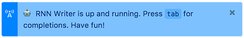

#atom-rnn-writer

This is a package for the [Atom](https://atom.io/) text editor that works with [`keras-char-rnn-server`](https://github.com/retdop/keras-char-rnn-server) to provide responsive, inline "autocomplete" powered by a recurrent neural network trained on a corpus of python libraries

###Installation

After downloading and installing Atom, get thee to a command line and do the following:

```
git clone https://github.com/retdop/atom-rnn-writer.git
cd rnn-writer
apm install
apm link
```

That last command -- `apm` stands for Atom Package Manager -- tells the application about the package.

Next, open Atom. Go to the Settings screen (`cmd+,`) and select Packages on the left. `rnn-writer` should be listed near the top. Enable it. Close Atom and reopen it again. Now you should be able to access `rnn-writer`'s settings -- again, `cmd+,` and find it near the top.

###Configuration

The only thing missing is the location of a server to provide the "autocompletions." You have two options:

1. Download and set up [`keras-char-rnn-server`](https://github.com/retdop/keras-char-rnn-server) along with its dependencies, which are many -- but you can skip several if you're using a pretrained model. After doing this, tell `rnn-writer` where to find `keras-rnn-server`, e.g. at `http://localhost:8080`.
2. Or...

###Use this thing!

This package only pays attention to files that have the `.txt` extension, so if you're typing in a fresh Atom window, be sure to save once (`noveldraft.txt`?) before proceeding.

**Activate the package using `ctrl-alt-r`.**



Here are the controls, which should feel intuitive:

| This key| does this
|---------|---------
|`tab`    | show suggested completions at the text insertion point
|`down` | scroll down through completions (and get more if necessary)
|`up` | scroll back up
|`return` or `tab` again | accept the current completion
|`left` or `escape` | reject all completions and reset
|(anything else) | continue editing as usual

You can always use `ctrl-alt-R` to deactivate the package and type normally again.

If you run into problems or have ideas for improvements, don't hesitate to open an issue. This is the first time I've bundled up code for other people to use, so I'm sure I made -- _am currently making_ -- some mistakes.

Enjoy!
